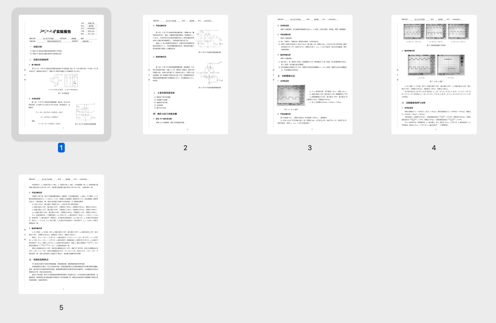
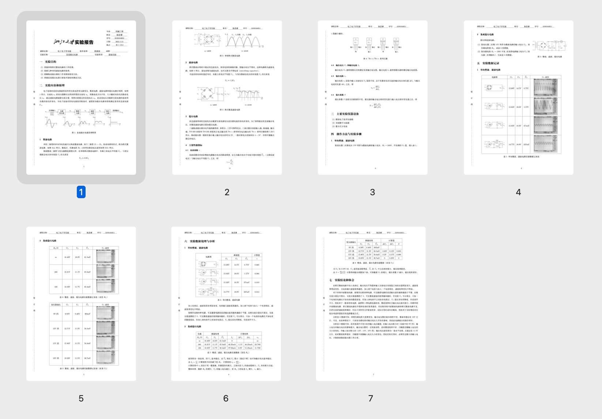

# 实验报告模板




## 如何使用

每次实验报告复制`template`文件夹，编辑该文件夹下的`main.tex`写实验报告。

## 关于`beginfile.tex`

考虑到同一门课程的实验报告格式基本统一，将正文之前的设置部分全部放入`beginfile.tex`，如果需要修改页面格式/添加package，请编辑该文档。

## 关于`resize.py`和`contrast.py`

在`template`文件夹下，有`resize.py`和`contrast.py`两个python文件。

`resize.py`用于统一图片大小（默认为示波器屏幕的4:3）和反转图片颜色（考虑到示波器屏幕底色为黑色）。

`contrast.py`用于修改图片为黑白并调整对比度。

将需要格式化的图片放在`pic`文件夹下，并依次运行`resize.py`和`contrast.py`。

（两个代码基本是从网上抄来改的……我也不懂）

tips：在实验拍波形的时候可以用手机相机自带的文档扫描拍，会自动裁剪。

## 写报告时可能用到的一些代码示例

- 插入单张图片
```latex
\begin{figure}[H]
	\centering
	\includegraphics[width=0.3\textwidth]{文件名}
	\caption{图片说明}
\end{figure}
```

- 插入多张图片（多张子图）
```latex
\begin{figure}[H]
	\centering
	\subfigure[第一张子图说明]{
		\includegraphics[width=0.3\textwidth]{第一张子图文件名}
	}
	\subfigure[第二张子图说明]{
		\includegraphics[width=0.3\textwidth]{第二张子图文件名}
	}
	\caption{图片说明}
\end{figure}
```

- 分为左右两列（需要在一侧插入图片的时候更推荐使用这种方式）
```latex
\hspace{-2.8em}\begin{tabular}{l l}
	\begin{minipage}{0.6\textwidth}
		左列内容
	\end{minipage}
	&
	\begin{minipage}{0.4\textwidth}
		右列内容
	\end{minipage}
\end{tabular}
```

- 插入表格

建议在[tablesgenerator](https://www.tablesgenerator.com/)上生成后复制粘贴到`main.tex`。
